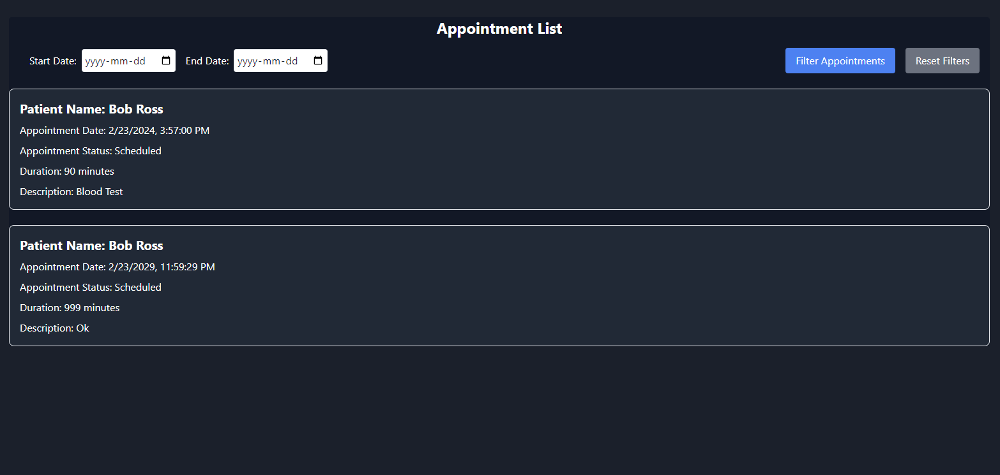

# Appointment List Viewer

Basic application which allows patients to view their appointments. The backend is done using Django with a SQLite database and the frontend is done with React and Tailwind CSS.


## Getting Started

Follow these steps to set up and use the project on your local machine.

1. **Clone the Repository:**

    First, clone the repository to your local machine using the following command:

    ```bash
    git clone https://github.com/houstonle/TotalLife
    ```

2. **Navigate to the Project Directory:**

    Change your current directory to the project directory:

    ```bash
    cd TotalLife
    ```


3. **Create a Virtual Environment:**

    It's recommended to use a virtual environment to isolate dependencies for this project. Run the following commands to create and activate a virtual environment:

    ```bash
    # On Windows
    python -m venv venv
    .\venv\Scripts\activate

    # On macOS/Linux
    python3 -m venv venv
    source venv/bin/activate
    ```

    This will create a virtual environment named `venv` and activate it. You should see the virtual environment name in your command prompt or terminal.

4. **Install Requirements:**

    With the virtual environment activated, install the project dependencies using the following command:

    ```bash
    pip install -r requirements.txt
    ```

    This will install the required packages specified in the `requirements.txt` file.

5. **Run the Backend:**

    Naviagate to the TLapp folder with the command `cd TLapp`. From here you need to make your migrations

    ```bash
    python3 manage.py makemigrations
    python3 manage.py migrate
    ```

    Now you can run the backend with the following command: `python3 manage.py runserver 0.0.0.0:8000`. This will run the server locally at port 8000.

6. **Run the Frontend:**

    Backout of the backend folder with the command `cd ..` and navigate the the frontend folder with the command `cd Frontend/totallife-app`. Now run the app with the following command

    ```bash
    npm start
    ```


7. **Deactivate Virtual Environment (Optional):**

    When you're done working on your project, you can deactivate the virtual environment using the following command:

    ```bash
    deactivate
    ```

## Usage



Click on the calender icon by start date and end date to set up filters. Pressing the `Filter Appointments` button will filter according to the dates you picked.
To reset filters press the `Reset Filters` button. The appointment list will reset and now display all appointments.
